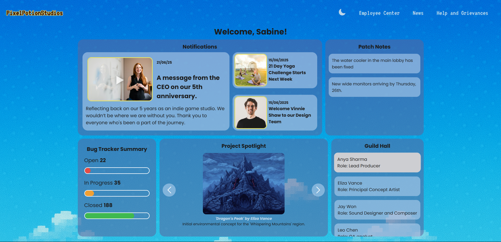
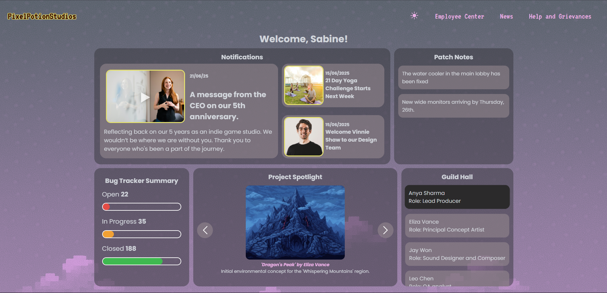

# Pixel Potion Studios - Intranet Dashboard

A retro-themed, responsive intranet dashboard for a fictional indie game studio, built with vanilla HTML, CSS, and JavaScript for the DEV.to "Frontend Challenge: Office Edition sponsored by Axero" as a submission to their Intranet Homepage prompt.

## About the Project

This project is an intranet homepage designed for the fictional indie game company, "Pixel Potion Studios." The goal was to create a digital workspace that is both functional and bursting with personality fit for a small indie dev company.

The dashboard features two distinct themes: a creative, pixel-art light mode that pays homage to classic 16-bit video games and a dark mode for based on the elements of the light mode to make it a seamless user experience. All components are built from scratch, focusing on clean code, accessibility, and a polished user experience with subtle, thematic animations.

## Key Features

* ### Dual Themes:
    A fully functional light/dark mode toggle that switches between a modern dark theme and a retro pixel-art light theme.

* ### Fully Responsive:
    A mobile-first design that looks great on all screen sizes, from a large desktop monitor to a small mobile phone.

* ### Interactive Components:
    * **Project spotlight**: A JavaScript-powered image carousel to showcase the latest artwork.
    * **Bug Tracker**: Dynamic progress bars that animate on load to display project status
    * **Guild Hall**: A scrollable list of team members.

* ### Polished Animations:
    Subtle on-load animations for the cards, retro-style hover effects, and smooth transitions to create a lively user experience.

## Tech Stack

This project was built from the ground up using only core web technologies.

* HTML5
* CSS3 (Flexbox for layout, custom properties for theming)
* Vanilla JavaScript (for all interactivity and DOM manipulation)

## Live Site

This project is hosted on GitHub pages, you can access the live version at the link below.

[PixelPotionStudios][def]

[def]: https://k4rtikay.github.io/PixelPotionStudios/